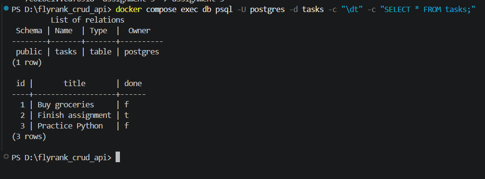

# Task API — Assignment 3 (FastAPI + PostgreSQL + Docker)

A CRUD API built with Python and FastAPI. Tasks are stored in PostgreSQL running in Docker, so they survive restarts, and the whole stack (API + database) starts with one command.

Storage history of this project: memory (A1) → SQLite (A2) → PostgreSQL in Docker (A3). The endpoints behave exactly as in A2.

## Run everything with one command

```bash
git clone -b assignment-3 https://github.com/aliyafatima001100-pixel/flyrank_crud_api.git
cd flyrank_crud_api
cp .env.example .env      # Windows PowerShell: copy .env.example .env
docker compose up
```

The API is at http://localhost:8000 and the Swagger docs are at http://localhost:8000/docs.

## Environment variables

Copy `.env.example` to `.env` before starting.

| Variable | Purpose |
| --- | --- |
| `POSTGRES_PASSWORD` | Password for the Postgres container |
| `POSTGRES_DB` | Database name (`tasks`) |
| `DATABASE_URL` | Connection string used when running the API outside Docker |

`.env` is git-ignored and never committed.

## Endpoints

| Method | Endpoint | Description | Status codes |
| --- | --- | --- | --- |
| GET | `/` | API metadata | `200` |
| GET | `/health` | Health check | `200` |
| GET | `/tasks` | List tasks (optional `search` and `done` filters) | `200` |
| GET | `/tasks/{id}` | Get one task | `200` / `404` |
| POST | `/tasks` | Create a task | `201` / `400` |
| PUT | `/tasks/{id}` | Update a task | `200` / `400` / `404` |
| DELETE | `/tasks/{id}` | Delete a task | `204` / `404` |

## Database

The `tasks` table is created automatically on startup if it is missing:

| Column | Type | Notes |
| --- | --- | --- |
| `id` | SERIAL | Primary key |
| `title` | TEXT | Required |
| `done` | BOOLEAN | Default false |

Three example tasks are inserted only on the first run, when the table is empty. All queries are parameterized (`%s`), so user input is never pasted into the SQL.

To run only the database without Compose (I use port 5433 because a local Postgres on my machine already used 5432):

```bash
docker run --name taskdb -e POSTGRES_PASSWORD=dev -e POSTGRES_DB=tasks -p 5433:5432 -v taskdata:/var/lib/postgresql/data -d postgres:16
```

Example query: `SELECT * FROM tasks WHERE done = true;`

## Example request (`curl -i`)

```bash
curl -i http://localhost:8000/tasks
```

```
HTTP/1.1 200 OK
date: Sun, 04 Oct 2026 14:30:42 GMT
server: uvicorn
content-length: 144
content-type: application/json

[{"id":1,"title":"Buy groceries","done":false},{"id":2,"title":"Finish assignment","done":true},{"id":3,"title":"Practice Python","done":false}]
```

## Database screenshot



## Persistence

I created a task, ran `docker compose down` and then `docker compose up`, and the task was still there. The data lives in the `taskdata` volume, which outlives the containers. (Do not use `docker compose down -v`; it deletes the volume.)

## What changed from A2

In A2 the SQL was written directly inside the route functions, so there was no separate storage layer to swap. For A3 I moved all database code into `db.py` and rewrote it for PostgreSQL, so the routes in `main.py` now only call it. The API behaviour (status codes, error messages, filters) is unchanged. `db.py` also retries on startup so the API waits for the database.